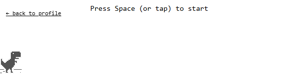

<!-- animated contribution graph: real data, boxes reveal cell by cell
     (refreshed hourly by .github/workflows/update-profile-art.yml) -->

<h3><code>rushi@github ~ $ ./contributions.sh</code></h3>

 
 

<a href="https://github.com/RushiAgrawal2004">github.com/RushiAgrawal2004</a>

<!-- README images can only animate (SMIL/CSS), never respond to input --
     GitHub sandboxes SVGs embedded via . So the actually-playable
     game lives on GitHub Pages instead and gets linked here. It's the
     real Chromium offline dino game (BSD-3-Clause, via
     github.com/wayou/t-rex-runner), not a recreation -- see game/. -->

<h3><code>rushi@github ~ $ ./no-wifi.exe</code></h3>

<a href="https://rushiagrawal2004.github.io/RushiAgrawal2004/game/">
  
   
  <b>▶ click to play</b>
</a>

