<!-- hero: monochrome ASCII portrait (types in, terminal-framed) stacked
     above the extruded 3D ascii wordmark (wipes in left-to-right, then rocks
     on its vertical axis, forever -- an intentional idle animation).
     Stacked rather than side-by-side because "RUSHI" (5 letters) needs a
     wider grid than the reference repo's 3-letter "AVI" to stay legible --
     see scripts/make_wordmark_svg.py.
     portrait: python scripts/prep_photo.py <photo> && python scripts/make_ascii_svg.py
     wordmark: python scripts/make_wordmark_svg.py --mode rock --out wordmark.svg -->

<h3><code>rushi@github ~ $ whoami</code></h3>

 

 
 

<!-- animated contribution graph: real data, boxes reveal cell by cell
     (regenerated daily by .github/workflows/update-profile-art.yml) -->

<h3><code>rushi@github ~ $ ./contributions.sh</code></h3>

 
 

<a href="https://github.com/RushiAgrawal2004">github.com/RushiAgrawal2004</a>

