<h1>Rushikesh Agrawal</h1>

<b>I build infrastructure for coding agents</b> — memory, observability, local inference.

  Pune, India&nbsp; ·&nbsp;
  <a href="https://www.rushikeshagrawal.site">rushikeshagrawal.site</a>

 

<!-- stack panel: hand-rolled terminal SVG, not shields.io badges -- every other
     panel on this profile is a dark terminal window, and third-party badge
     images would read as a different site pasted into this one. Chips fade in
     row by row once, then freeze; only the footer cursor keeps blinking.
     regenerate: python scripts/make_stack_svg.py -->

<h3><code>rushi@github ~ $ cat stack.txt</code></h3>

 
 

<h3><code>rushi@github ~ $ ls -la ~/projects</code></h3>

<!-- four repos that actually say something about the work, not the four
     newest. Kept as a markdown table so the links stay clickable and the
     stack column stays readable on mobile, where an SVG this wide wouldn't. -->

| project | what it is | stack |
| :-- | :-- | :-- |
| **[keel](https://github.com/RushiAgrawal2004/keel)** | Blackbox recorder for coding agents — records sessions, commands, outputs and repo state, and serves the project graph back over MCP. `pip install keel-arch` | `Python` `MCP` |
| **[memoryengine](https://github.com/RushiAgrawal2004/memoryengine)** | Persistent memory for coding agents, grounded in real repo facts — git refs, paths, symbols, SHAs — so staleness is mechanical instead of guessed. | `TypeScript` `Hono` `Drizzle` `Postgres` |
| **[optimum](https://github.com/RushiAgrawal2004/optimum)** | Auto-tunes `llama.cpp` for your exact GPU and model: measures real speed *and* real answer quality, then hands the winning config straight to the web UI. | `Python` `llama.cpp` |
| **[Subtext](https://github.com/RushiAgrawal2004/Subtext-app)** | Image tooling app — in-browser background removal, auth and billing wired end to end. | `Next.js` `Supabase` `Stripe` |

<a href="https://github.com/RushiAgrawal2004?tab=repositories">→ every other repo</a>

 

<!-- animated contribution graph: real data, boxes reveal cell by cell
     (refreshed hourly by .github/workflows/update-profile-art.yml) -->

<h3><code>rushi@github ~ $ ./contributions.sh</code></h3>

 
 

<!-- README images can only animate (SMIL/CSS), never respond to input --
     GitHub sandboxes SVGs embedded via . So the actually-playable
     game lives on GitHub Pages instead and gets linked here. It's the
     real Chromium offline dino game (BSD-3-Clause, via
     github.com/wayou/t-rex-runner), not a recreation -- see game/. -->

<h3><code>rushi@github ~ $ ./no-wifi.exe</code></h3>

<a href="https://rushiagrawal2004.github.io/RushiAgrawal2004/game/"><b>▶ click to play</b></a>

 

<h3><code>rushi@github ~ $ curl -s /contact</code></h3>

  <a href="https://www.rushikeshagrawal.site">website</a>&nbsp; ·&nbsp;
  <a href="https://github.com/RushiAgrawal2004">github.com/RushiAgrawal2004</a>

